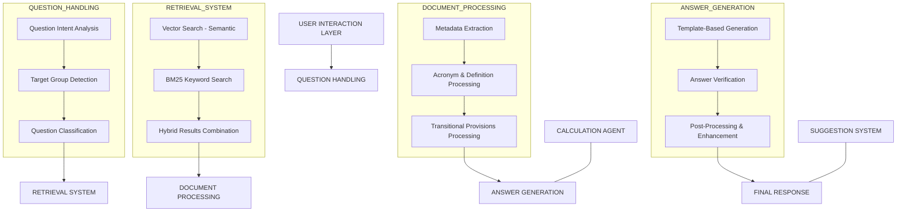

# PENSION ADVISOR RAG SYSTEM - IMPLEMENTATION PLAN

## PHASE 1: RETRIEVAL IMPROVEMENTS
- [x] **[DONE]** 1.1 Implement hybrid retrieval (BM25 + vector search)
- [x] **[DONE]** 1.2 Add metadata filtering options
- [ ] 1.3 Implement re-ranking of search results
  - Use a cross-encoder model to re-rank initial results
  - Add configuration parameter for re-ranking threshold
- [ ] 1.4 Add semantic clustering for related chunks
  - Group semantically similar chunks in results
  - Present clusters as organized information blocks
- [ ] 1.5 Implement simple A/B testing framework for retrieval methods

## PHASE 2: DOCUMENT PROCESSING ENHANCEMENTS
- [x] **[DONE]** 2.1 Extract and use acronyms and definitions
- [x] **[DONE]** 2.2 Add structured transitional provisions metadata
- [ ] 2.3 Improve table extraction and formatting
  - Detect tables in PDF documents
  - Convert to structured format for better retrieval
- [ ] 2.4 Add cross-reference detection between documents
  - Identify references to other pension agreements
  - Create links between related documents
- [x] **[DONE]** 2.5 Add structured metadata for transitional provisions

## PHASE 3: ANSWER GENERATION IMPROVEMENTS
- [x] **[DONE]** 3.1 Implement answer verification to prevent empty referrals
- [x] **[DONE]** 3.2 Create structured answer templates for different question types
- [x] **[DONE]** 3.3 Add post-processing to ensure answers include requested information
- [x] **[DONE]** 3.4 Improve handling of comparison questions
  - Detect comparison intent in user questions
  - Create specialized templates for side-by-side comparisons
  - Implement tabular format for clear comparison results
- [x] **[DONE]** 3.5 Add confidence scoring for generated answers
  - Evaluate evidence strength, context relevance, answer completeness, and internal consistency
  - Calculate weighted confidence score and display to users
  - Show breakdown of problematic factors for lower confidence answers
  - Display confidence level to users for transparency
- [x] **[DONE]** 3.6 Implement pension calculation agent
  - Created specialized agent for handling calculation questions
  - Implemented formulas for different pension agreements (ITP1, ITP2, SAF-LO, PA16)
  - Added support for common calculation types (retirement estimates, early retirement impact, etc.)
  - Created visualization of calculation results
  - Built calculation dashboard for users
- [x] **[DONE]** 3.7 Develop smart data extraction for calculation parameters
  - Created pattern recognition system for calculation-related information using regex
  - Implemented parameter extraction (percentages, thresholds, caps) from pension agreements
  - Added automatic parameter updates detection for agreement changes
  - Implemented metadata tagging for calculation-relevant chunks
  - Built verification system to ensure calculation accuracy

## PHASE 4: USER EXPERIENCE AND FEEDBACK
- [x] **[DONE]** 4.1 Implement simple feedback mechanism for answers
  - Add thumbs up/down buttons for user feedback
  - Store feedback data for future analysis
  - Create simple reporting interface with dashboard visualization
- [x] **[DONE]** 4.2 Add conversation context management
  - Create a `ConversationManager` class to track conversation history
  - Implement context-aware question answering
  - Add reference resolution for follow-up questions
  - Store conversation sessions for future reference
  - Create conversation dashboard for viewing conversation history
- [ ] 4.3 Create a logging dashboard for system performance
  - Implement structured logging with performance metrics
  - Create a real-time performance monitoring dashboard
  - Add visualizations for response times and success rates
  - Include error tracking and categorization
- [ ] 4.4 Implement question categorization
  - Automatically categorize questions by topic
  - Track category distribution for insights
  - Use categories to improve retrieval context
  - Create category-specific answer templates
- [x] **[DONE]** 4.5 Add follow-up question suggestions
  - Detect potential follow-up questions based on current question and context
  - Suggest 3-5 follow-up questions after each answer
  - Track which suggestions are selected by users
- [x] **[DONE]** 4.6 Add suggestion statistics and analytics
  - Track which suggestions are most frequently used
  - Identify most popular topics for suggestions
  - Provide dashboard for suggestion usage analytics
  - Calculate usage rates and agreement distribution
- [x] **[DONE]** 4.7 Implement LangGraph visualization
  - Create a visual representation of the agent workflow
  - Implement real-time visualization of agent states
  - Add interactive debugging capabilities
  - Provide insights into agent decision-making process

## PHASE 5: DOMAIN MEMORY & PERSONALIZATION
- [ ] 5.1 Implement user profiles and preferences
  - Create user profile storage system
  - Allow users to set preferences (language, detail level, etc.)
  - Implement preference-based answer customization
- [ ] 5.2 Add session tracking for context retention
  - Maintain conversation history across sessions
  - Implement secure session management
  - Allow users to reference previous sessions
- [ ] 5.3 Create personalized answer formatting
  - Adapt answer format based on user preferences
  - Implement different detail levels (basic, detailed, expert)
  - Support multiple output formats (text, structured, visual)
- [ ] 5.4 Implement target group detection
  - Dynamically detect user's pension situation
  - Identify relevant target groups from questions
  - Customize answers based on detected groups
- [ ] 5.5 Add personalized examples in answers
  - Generate examples relevant to user's situation
  - Create age/role-appropriate scenarios
  - Store effective examples for reuse

## TESTING AND VALIDATION
- [ ] T.1 Create a standard test set of questions covering all identified problem areas
  - Develop 50+ test questions across different categories
  - Include edge cases and challenging scenarios
  - Create expected answer guidelines for evaluation
- [ ] T.2 Develop automated metrics for answer quality
  - Implement ROUGE, BLEU, or similar metrics
  - Create custom relevance and completeness metrics
  - Establish baseline performance benchmarks
- [ ] T.3 Implement before/after comparison for changes
  - Save system responses before and after changes
  - Create side-by-side comparison tool
  - Quantify improvements with metrics
- [ ] T.4 Document examples of improved answers
  - Create case studies of significant improvements
  - Highlight specific techniques that worked well
  - Use for future training and documentation

## IMPLEMENTATION NOTES

### How to Use This Plan
1. As each task is completed, change "[ ]" to "[x]" and update the text color to green
2. Add implementation details or notes under each item as needed
3. Document any challenges or decisions made during implementation

### Priority Order
1. ✅ **COMPLETED** - Phase 1.1, 2.1, 3.1 (Hybrid retrieval, acronym extraction, answer verification)
2. ✅ **COMPLETED** - Phase 2.2, 3.2, 3.3 (Transitional provisions, structured templates, post-processing)
3. ✅ **COMPLETED** - Phase 3.4, 3.5, 3.6, 3.7 (Comparison questions, confidence scoring, calculation agent, data extraction)
4. ✅ **COMPLETED** - Phase 4.1, 4.2, 4.5, 4.6 (Follow-up suggestions, suggestion statistics, suggestion dashboard)
5. **NEXT PRIORITY** - Phase 4.3, 4.4 (Context management, logging, categorization)
6. Phase 5.1-5.5 (User profiles, session tracking, personalization)

### Rollback Procedure
1. Each feature is implemented with feature flags in config.py
2. To rollback, set the corresponding flag to False
3. Keep backup copies of modified files for quick manual rollback if needed
4. Document dependencies between features for safe rollbacks
5. Maintain backward compatibility where possible

### Implementation Guidelines
1. Create unit tests for each new feature
2. Document all changes in the system documentation
3. Conduct regular performance testing after each phase
4. Focus on modular design to simplify future extensions
5. Use feature flags for gradual rollout and testing

## SYSTEM VISUALIZATION

### Enhanced Pension Advisor RAG System Architecture

**System Components:**

1. **User Interaction Layer**: Handles user input and session management
2. **Question Handling**: Analyzes and classifies user queries
3. **Retrieval System**: Finds relevant document chunks using hybrid search
4. **Document Processing**: Extracts and processes metadata from documents
5. **Answer Generation**: Creates structured, verified responses
6. **Calculation Agent**: Handles pension calculation queries
7. **Suggestion System**: Provides follow-up question suggestions

### Implemented Improvements

1. **Retrieval System** ✅
   - Hybrid search combining semantic (vector) and keyword (BM25) approaches
   - Configurable weighting between search methods
   - Metadata filtering for more precise results

2. **Document Processing** ✅
   - Enhanced metadata extraction for acronyms and definitions
   - Structured transitional provisions metadata
   - Improved chunking strategy to maintain context
   - Target group detection and tagging

3. **Answer Generation** ✅
   - Answer verification to prevent empty referrals
   - Structured answer templates based on question type
   - Post-processing to ensure answers include requested information

### Upcoming Improvements

1. **Enhanced Comparison Handling**
   - Specialized templates for side-by-side comparisons
   - Tabular format for clear comparison results

2. **User Experience**
   - Confidence scoring for generated answers
   - Feedback mechanism for continuous improvement
   - Follow-up question suggestions

3. **Personalization**
   - User profiles and preferences
   - Target group detection for customized answers
